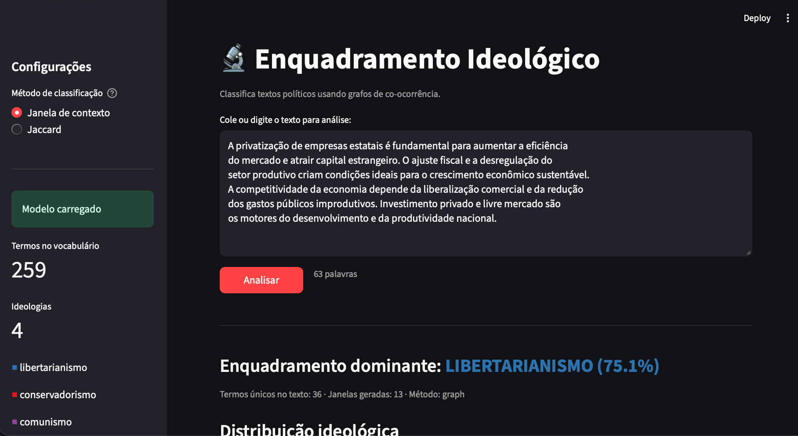
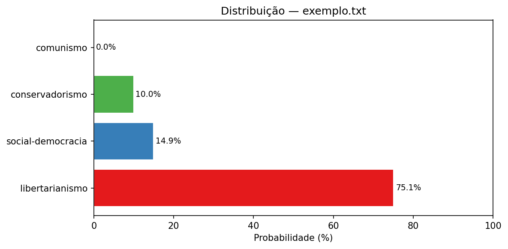
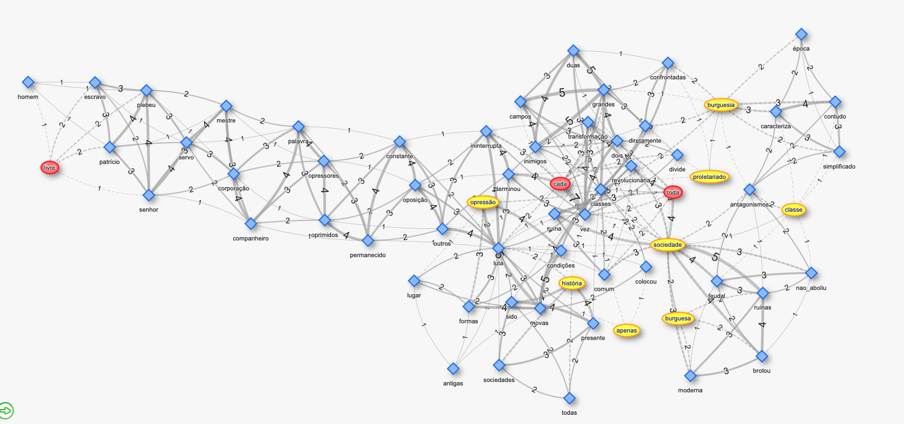
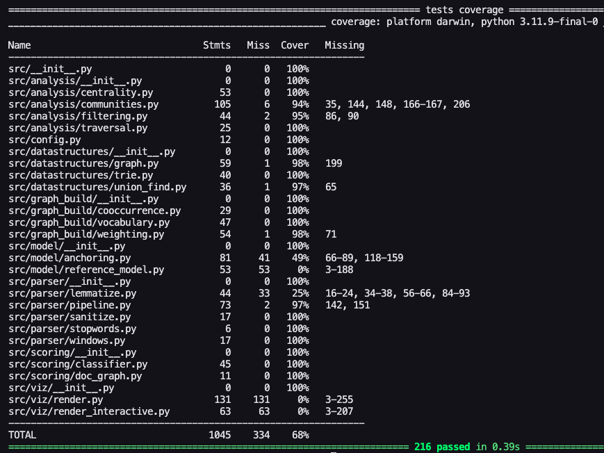

# Enquadramento Ideológico

#### Análise textual de enquadramento ideológico baseada em grafos

> Trabalho acadêmico — **Estruturas de Dados 2** · Prof. Glauco e John · FCTE / UnB

[](https://python.org)
[](tests/)
[](app.py)
[](LICENSE)

---

## 👥 Equipe

| Nome                                 | Matrícula | GitHub                                               |
| ------------------------------------ | --------- | ---------------------------------------------------- |
| Letícia de Cássia Hladczuk Rodrigues | 221039209 | [@HladczukLe](https://github.com/HladczukLe)         |
| Lucas Fujimoto Tokunaga              | 241025283 | [@Lucasft16](https://github.com/Lucasft16)           |
| Arthur Fonseca Vale                  | 221031120 | [@arthurfonsecaa](https://github.com/arthurfonsecaa) |
| Vitor Feijó Leonardo                 | 221008516 | [@vitorfleonardo](https://github.com/vitorfleonardo) |

---

## 📌 O Problema

> **"Dado um texto não-estruturado, qual ideologia ele enquadra?"**

Identificar o viés ideológico de um texto é uma tarefa difícil: não há rótulo explícito, o vocabulário é polissêmico e o contexto de uso das palavras importa tanto quanto as próprias palavras. Nossa abordagem resolve isso construindo um **grafo de co-ocorrência** de termos e usando estrutura de comunidades para descobrir grupos semânticos associados a cada ideologia.

O sistema classifica qualquer texto em uma das **4 vertentes**:

| Ideologia            | Cor       | Exemplos de termos centrais                    |
| -------------------- | --------- | ---------------------------------------------- |
| 🔵 Libertarianismo   | `#377eb8` | mercado, privatização, desregulação, capital   |
| 🔴 Conservadorismo   | `#e41a1c` | família, tradição, ordem, pátria, valores      |
| 🟣 Comunismo         | `#984ea3` | proletariado, revolução, classe, coletivização |
| 🟢 Social-democracia | `#4daf4a` | redistribuição, direitos, sindicato, educação  |

---

## 🧠 Modelagem do Grafo

O coração do projeto é um **grafo ponderado não-direcionado** onde cada nó é um termo do vocabulário e cada aresta representa a força com que dois termos co-ocorrem no corpus.

### Vértices

Cada vértice é um **termo lexical** extraído do corpus após o pipeline de limpeza (remoção de stopwords, pontuação e normalização). Expressões multipalavra como `livre_mercado` e `bem_estar_social` são tratadas como um único vértice pela **Trie** de marcadores.

### Arestas e Pesos

Para cada **janela deslizante** de `window_size = 5` palavras no texto, todos os pares de termos distintos dentro da janela recebem uma co-ocorrência. O peso final de cada aresta é calculado por **NPMI** (Normalized Pointwise Mutual Information):

```
NPMI(u, v) = log[ P(u,v) / (P(u) · P(v)) ] / -log[ P(u,v) ]
```

O NPMI varia de `−1` (nunca co-ocorrem) a `+1` (sempre juntos); `0` = independência estatística. Pesos altos indicam associação semântica real, não mera frequência.

### Filtragem — Algoritmo de Kruskal

O grafo bruto tem milhares de arestas ruidosas. Aplicamos o **algoritmo de Kruskal de peso máximo** para extrair o _backbone_ da rede: as arestas de maior peso que conectam todos os vértices sem formar ciclos. Usamos nossa implementação própria de **Union-Find** para detecção de ciclos em `O(α(n))` amortizado.

```
grafo completo (n arestas) → Kruskal → floresta geradora máxima (n−1 arestas)
```

### Comunidades — Girvan-Newman

Com o backbone filtrado, detectamos agrupamentos semânticos com o algoritmo **Girvan-Newman**:

1. Calcula a **betweenness centrality** de cada aresta (via algoritmo de Brandes, baseado em BFS)
2. Remove a aresta de maior betweenness (ponte entre comunidades)
3. Repete até a **modularidade de Newman** parar de crescer

O resultado são comunidades de palavras semanticamente relacionadas — "família", "tradição" e "ordem" tendem a formar um cluster juntas.

### Ancoragem Ideológica

Cada comunidade detectada é atribuída a uma ideologia pela contagem de **seeds** (palavras-âncora definidas em `data/lexicons/seeds.json`) que ela contém. O processo combina dois sinais:

- **Seeds léxicas**: termos âncora por ideologia (ex.: `"mercado"` ancora libertarianismo)
- **Rótulos supervisionados**: proporção de documentos de cada ideologia no corpus que ativam aquela comunidade

### Coloração e Tamanho dos Nós

| Elemento visual        | Significado                                                       |
| ---------------------- | ----------------------------------------------------------------- |
| Cor do nó              | Ideologia atribuída pela comunidade (cinza = sem correspondência) |
| Tamanho do nó          | Centralidade de grau no modelo de referência                      |
| Espessura da aresta    | Número de janelas em que o par co-ocorre no documento             |
| Aresta tracejada cinza | Ponte entre termos de ideologias diferentes                       |
| Número na aresta       | Co-ocorrências repetidas no documento (exibido quando `w > 1`)    |

### Representação interna

O grafo usa **lista de adjacência** implementada do zero:

```python
Graph._adj: dict[str, dict[str, float]]  # _adj[u][v] = peso
```

Isso garante `O(1)` para verificar adjacência, `O(grau)` para percorrer vizinhos e espaço `O(V + E)`.

---

## 📂 Estrutura de Pastas

```
enquadramento-ideologico/
│
├── config.yaml                   # parâmetros globais do modelo
│
├── app.py                        # interface Streamlit
│
├── scripts/
│   ├── generate_corpus.py        # Fase 0 — gera corpus sintético rotulado
│   ├── build_model.py            # Fase A — treina o modelo de referência
│   └── classify.py               # Fase B — classifica um documento novo
│
├── src/
│   ├── config.py
│   ├── datastructures/
│   │   ├── graph.py              # Grafo ponderado (lista de adjacência)
│   │   ├── trie.py               # Trie para expressões multipalavra
│   │   └── union_find.py         # Union-Find para Kruskal
│   ├── parser/
│   │   ├── pipeline.py           # orquestra tokenização → janelas
│   │   ├── sanitize.py           # limpeza de texto
│   │   ├── stopwords.py          # lista de stopwords PT-BR
│   │   └── windows.py            # geração de janelas deslizantes
│   ├── graph_build/
│   │   ├── vocabulary.py         # vocabulário com frequência por janela
│   │   ├── cooccurrence.py       # contagem de pares de termos
│   │   └── weighting.py          # NPMI · frequência · Jaccard
│   ├── analysis/
│   │   ├── filtering.py          # Kruskal · threshold · disparity filter
│   │   ├── communities.py        # Girvan-Newman · propagação de rótulos
│   │   ├── centrality.py         # grau · Brandes (betweenness)
│   │   └── traversal.py          # BFS · componentes conexos
│   ├── model/
│   │   ├── reference_model.py    # pipeline completo: corpus → model.json
│   │   └── anchoring.py          # seeds + rótulos → ideologia por comunidade
│   ├── scoring/
│   │   ├── classifier.py         # entry-point: classify(windows, model)
│   │   └── doc_graph.py          # scorer por grafo do próprio documento
│   └── viz/
│       ├── render.py             # subgrafo estático (matplotlib/PNG)
│       └── render_interactive.py # grafo interativo (pyvis/HTML)
│
├── data/
│   ├── raw/corpus.jsonl          # corpus gerado (criado pelo script)
│   ├── examples/                 # textos .txt para classificar
│   └── lexicons/
│       ├── seeds.json            # palavras-âncora por ideologia
│       └── markers.txt           # expressões multipalavra
│
├── outputs/
│   ├── models/model.json         # modelo treinado (gerado pelo script)
│   └── figures/                  # PNGs e HTMLs gerados
│
├── tests/                        # 216 testes pytest
└── requirements.txt
```

---

## ⚙️ Arquitetura Geral

O projeto opera em **três fases sequenciais**:

```
┌─────────────────────────────────────────────────────────────┐
│  FASE 0 — generate_corpus.py                                │
│  templates + léxicos → corpus.jsonl (160 docs rotulados)    │
└────────────────────────────┬────────────────────────────────┘
                             │
                             ▼
┌─────────────────────────────────────────────────────────────┐
│  FASE A — build_model.py                                    │
│                                                             │
│  corpus.jsonl                                               │
│      │ process_document() × 160                             │
│      ▼                                                      │
│  janelas deslizantes (window_size=5)                        │
│      │ build_vocab_from_windows() + prune(min_df, max_df)   │
│      ▼                                                      │
│  Vocabulário filtrado                                       │
│      │ count_cooccurrences()                                │
│      ▼                                                      │
│  Grafo bruto → NPMI → Kruskal → Girvan-Newman               │
│      │ anchor_communities_supervised()                      │
│      ▼                                                      │
│  model.json  ← ideology_terms · graph_edges · communities  │
└────────────────────────────┬────────────────────────────────┘
                             │
                             ▼
┌─────────────────────────────────────────────────────────────┐
│  FASE B — classify.py / app.py                              │
│                                                             │
│  texto.txt                                                  │
│      │ process_document()                                   │
│      ▼                                                      │
│  janelas do documento                                       │
│      │ score_document_graph() ou score_document_jaccard()   │
│      ▼                                                      │
│  {libertarianismo: 75.1%, social-democracia: 14.9%, ...}   │
│      │                                                      │
│      ├─ terminal (barras ASCII)                             │
│      ├─ exemplo.png (subgrafo estático)                     │
│      ├─ exemplo_bars.png (distribuição)                     │
│      └─ exemplo_grafo.html (grafo interativo)               │
└─────────────────────────────────────────────────────────────┘
```

---

## 🔬 Os 3 Scripts Principais

### `generate_corpus.py` — Geração do Corpus

O corpus de treino é **sintético e rotulado**: não usamos dados externos. Ele é gerado por templates linguísticos preenchidos com léxicos ideológicos controlados.

**Como funciona:**

- 10 templates de frases por ideologia (ex.: `"O livre {A} promove {B} e distribui {C} de forma eficiente."`)
- Léxico próprio de 18–24 termos por ideologia
- 40 documentos × 4 ideologias = **160 documentos**; cada documento tem 3–5 frases
- Semente aleatória fixa (`seed=42`) garante reprodutibilidade

**Estrutura de saída** — `data/raw/corpus.jsonl`:

```jsonc
{"ideology": "libertarianismo", "text": "O livre comércio promove eficiência e distribui capital de forma eficiente. ..."}
{"ideology": "conservadorismo", "text": "A família é o alicerce da sociedade e deve ser preservada. ..."}
```

**Por que sintético?** Permite controle total dos rótulos e dos padrões lexicais, essencial para o treino supervisionado e para avaliar o sistema de forma reproduzível. A seção de limitações discute o impacto disso na generalização.

```bash
python scripts/generate_corpus.py
# → data/raw/corpus.jsonl  (160 documentos)
```

---

### `build_model.py` — Construção do Modelo de Referência

Este script executa o **pipeline completo da Fase A** e salva o modelo de referência usado por toda a Fase B.

**Pipeline interno:**

| Etapa            | O que faz                                                                | Parâmetro em config.yaml |
| ---------------- | ------------------------------------------------------------------------ | ------------------------ |
| 1. Parser        | Tokeniza, remove stopwords, reconhece marcadores multipalavra via Trie   | `window_size`            |
| 2. Vocabulário   | Conta frequência de cada termo por janela; descarta termos raros/ubíquos | `min_df`, `max_df`       |
| 3. Coocorrências | Conta pares de termos que compartilham a mesma janela                    | —                        |
| 4. Ponderação    | Calcula NPMI, frequência bruta ou Jaccard para cada par                  | `weight_method`          |
| 5. Filtragem     | Kruskal (backbone), threshold ou disparity filter                        | `filter_method`          |
| 6. Comunidades   | Girvan-Newman ou propagação de rótulos                                   | `community_method`       |
| 7. Ancoragem     | Seeds + rótulos do corpus → ideologia por comunidade                     | `--label-weight`         |
| 8. Centralidade  | Grau de cada termo no grafo filtrado → score de importância              | —                        |

**Saída** — `outputs/models/model.json`:

```jsonc
{
  "ideology_terms": {
    "libertarianismo": {"mercado": 0.31, "privatização": 0.28, ...},
    "conservadorismo": {"família": 0.29, "tradição": 0.25, ...},
    ...
  },
  "graph_edges": [["mercado", "privatização", 0.91], ...],
  "communities": [["mercado", "capital", ...], ["família", "ordem", ...], ...],
  "vocab_size": 259,
  "supervised": true
}
```

```bash
python scripts/build_model.py
# → outputs/models/model.json

# Opções adicionais:
python scripts/build_model.py --no-supervision        # usa apenas seeds
python scripts/build_model.py --label-weight 0.7      # mais peso nos rótulos do corpus
```

---

### `classify.py` — Classificação de um Documento

Recebe qualquer arquivo `.txt`, executa o pipeline de Fase B e gera 4 saídas.

**O que acontece internamente:**

1. Carrega `model.json` e a Trie de marcadores
2. Roda `process_document()` no texto: tokeniza, remove stopwords, gera janelas deslizantes
3. Chama `classify(windows, model, method=...)`:
   - **`graph`** (padrão): constrói um grafo de co-ocorrência do próprio documento e combina `node_score` (termos ideológicos presentes) + `edge_score` (pares ideológicos que co-ocorrem na mesma janela). Termos que aparecem juntos no mesmo contexto contribuem mais.
   - **`jaccard`**: compara apenas o conjunto de termos presentes (bag-of-words ponderado); ignora a estrutura de co-ocorrência do documento.
4. Normaliza os scores para distribuição de probabilidade (soma = 1)
5. Gera as saídas visuais

**Diferença entre os métodos:**

| Método    | Considera contexto | Velocidade           | Quando usar                         |
| --------- | ------------------ | -------------------- | ----------------------------------- |
| `graph`   | ✅ Sim             | Levemente mais lento | Textos com argumentação estruturada |
| `jaccard` | ❌ Não             | Mais rápido          | Textos curtos ou listas de termos   |

```bash
python scripts/classify.py data/examples/exemplo.txt
python scripts/classify.py data/examples/exemplo.txt --method jaccard
python scripts/classify.py data/examples/meu_texto.txt --out-dir outputs/figures/
```

---

## 🔧 Algoritmos e Conceitos Implementados

| Algoritmo / Conceito                               | Papel no projeto                                                          | Arquivo                            |
| -------------------------------------------------- | ------------------------------------------------------------------------- | ---------------------------------- |
| **Janela deslizante** (_context window_)           | Captura co-ocorrências locais entre termos                                | `src/parser/windows.py`            |
| **NPMI** (Normalized Pointwise Mutual Information) | Peso estatístico das arestas                                              | `src/graph_build/weighting.py`     |
| **Jaccard ponderado**                              | Método alternativo de classificação                                       | `src/scoring/classifier.py`        |
| **Algoritmo de Kruskal** (max-spanning)            | Filtragem do backbone do grafo                                            | `src/analysis/filtering.py`        |
| **Union-Find** (path compression + union by rank)  | Detecção de ciclos para Kruskal                                           | `src/datastructures/union_find.py` |
| **BFS** (Busca em Largura)                         | Base do Brandes + componentes conexos                                     | `src/analysis/traversal.py`        |
| **Betweenness Centrality** (algoritmo de Brandes)  | Identifica arestas ponte para Girvan-Newman                               | `src/analysis/centrality.py`       |
| **Girvan-Newman**                                  | Detecção de comunidades semânticas                                        | `src/analysis/communities.py`      |
| **Modularidade de Newman**                         | Critério de parada do Girvan-Newman                                       | `src/analysis/communities.py`      |
| **Propagação de Rótulos**                          | Alternativa mais rápida ao Girvan-Newman                                  | `src/analysis/communities.py`      |
| **Centralidade de grau**                           | Score de importância dos termos (tamanho do nó)                           | `src/analysis/centrality.py`       |
| **Trie** (árvore de prefixos)                      | Reconhecimento eficiente de marcadores multipalavra                       | `src/datastructures/trie.py`       |
| **Disparity Filter**                               | Filtragem alternativa por significância estatística                       | `src/analysis/filtering.py`        |
| **Ancoragem supervisionada**                       | Combina seeds + rótulos do corpus para atribuir ideologias às comunidades | `src/model/anchoring.py`           |
| **Grafo co-ocorrência do documento**               | Scorer da Fase B que captura relações contextuais                         | `src/scoring/doc_graph.py`         |

---

## 🚀 Como Executar

### 1. Requisitos

- Python 3.10 ou superior
- pip

### 2. Instalação

```bash
git clone https://github.com/Lucasft16/enquadramento-ideologico
cd enquadramento-ideologico
pip install -r requirements.txt
```

### 3. Pipeline via Linha de Comando

Execute os 3 comandos em sequência:

```bash
# Fase 0 — gera o corpus de treino
python scripts/generate_corpus.py

# Fase A — treina o modelo (precisa rodar apenas uma vez)
python scripts/build_model.py

# Fase B — classifica um texto
python scripts/classify.py data/examples/exemplo.txt
```

### 4. Interface Streamlit

```bash
streamlit run app.py
```



A interface permite:

- Colar ou digitar qualquer texto
- Escolher o método de classificação (Janela de Contexto ou Jaccard)
- Ver a distribuição ideológica em barras
- Baixar o grafo interativo HTML para abrir no navegador

---

## 📊 Exemplos de Entrada e Saída

### Entrada — `data/examples/exemplo.txt`

```
A privatização de empresas estatais é fundamental para aumentar a eficiência
do mercado e atrair capital estrangeiro. O ajuste fiscal e a desregulação do
setor produtivo criam condições ideais para o crescimento econômico sustentável.
A competitividade da economia depende da liberalização comercial e da redução
dos gastos públicos improdutivos. Investimento privado e livre mercado são
os motores do desenvolvimento e da produtividade nacional.
```

### Saída no Terminal

```
Modelo carregado: 259 termos, 258 arestas
Documento: exemplo.txt (447 caracteres)
Termos únicos no documento: 36
Janelas geradas: 13

==================================================
DISTRIBUICAO IDEOLOGICA
==================================================
  libertarianismo       75.1%  ##############################
  social-democracia     14.9%  #####
  conservadorismo       10.0%  ###
  comunismo              0.0%
==================================================

Enquadramento dominante: libertarianismo (75.1%)
```

### Distribuição Ideológica (Barras)



### Grafo Interativo (HTML)

O grafo interativo é gerado em `outputs/figures/exemplo_grafo.html`. Abra no navegador para explorar:

- Arraste os nós
- Zoom com scroll
- Passe o mouse para ver a ideologia e centralidade de cada termo
- Arestas tracejadas = pontes entre ideologias diferentes



### Outros Exemplos Incluídos

| Arquivo                      | Enquadramento dominante                      |
| ---------------------------- | -------------------------------------------- |
| `data/examples/exemplo.txt`  | Libertarianismo (75.1%)                      |
| `data/examples/exemplo2.txt` | _(veja `outputs/figures/exemplo2_bars.png`)_ |
| `data/examples/exemplo3.txt` | _(veja `outputs/figures/exemplo3_bars.png`)_ |
| `data/examples/exemplo4.txt` | _(veja `outputs/figures/exemplo4_bars.png`)_ |
| `data/examples/exemplo5.txt` | _(veja `outputs/figures/exemplo5_bars.png`)_ |

---

## ➕ Como Adicionar Novos Exemplos

### Classificar um novo texto

Crie um arquivo `.txt` em `data/examples/` e execute:

```bash
python scripts/classify.py data/examples/meu_texto.txt
```

O pipeline de limpeza roda automaticamente — pontuação, maiúsculas e stopwords são tratadas.

### Expandir as palavras-âncora (seeds)

Edite `data/lexicons/seeds.json` e reconstrua o modelo:

```json
{
  "libertarianismo": ["liberdade", "mercado", "privatização", ...],
  "conservadorismo": ["família", "tradição", "ordem", ...],
  "comunismo":       ["proletariado", "revolução", "classe", ...],
  "social-democracia": ["redistribuição", "direitos", "sindicato", ...]
}
```

```bash
python scripts/build_model.py
```

### Adicionar expressões multipalavra

Adicione uma linha em `data/lexicons/markers.txt`:

```
livre mercado
bem estar social
estado mínimo
propriedade privada
```

A Trie reconhece essas expressões como token único durante o processamento.

### Ajustar parâmetros do modelo

Edite `config.yaml`:

```yaml
window_size: 5 # palavras por janela (maior = contexto mais amplo)
min_df: 2 # descarta termos que aparecem em menos de N janelas
max_df: 0.95 # descarta termos em mais de 95% das janelas (stopwords funcionais)
weight_method: npmi # frequency | npmi | jaccard
filter_method: kruskal # kruskal | threshold | disparity
community_method: girvan_newman # girvan_newman | label_propagation
threshold: 0.1 # peso mínimo de aresta (só para filter_method: threshold)
disparity_alpha: 0.05 # nível de significância (só para filter_method: disparity)
```

Após qualquer mudança em `config.yaml` ou `seeds.json`, reconstrua o modelo com `python scripts/build_model.py`.

---

## 🧪 Testes

```bash
# Roda todos os testes
pytest tests/ -v

# Com cobertura de código
pytest tests/ --cov=src --cov-report=term-missing
```



**216 testes** distribuídos em 7 módulos:

| Módulo de teste          | O que cobre                                   |
| ------------------------ | --------------------------------------------- |
| `test_datastructures.py` | `Graph`, `Trie`, `UnionFind`                  |
| `test_parser.py`         | tokenização, stopwords, janelas               |
| `test_graph_build.py`    | vocabulário, coocorrências, ponderação        |
| `test_analysis.py`       | filtragem, comunidades, centralidade, BFS |
| `test_anchoring.py`      | seeds, ancoragem supervisionada               |
| `test_scoring.py`        | Jaccard, grafo do documento, normalização     |
| `test_integration.py`    | pipeline ponta-a-ponta                        |

---

## ⚠️ Limitações

**Corpus sintético** — O modelo foi treinado em textos gerados por templates com léxicos controlados. Textos reais (artigos, discursos, redes sociais) têm vocabulário mais ruidoso e padrões irregulares; o desempenho pode ser inferior fora do domínio sintético.

**4 ideologias fixas** — O espectro político é contínuo e multidimensional. O sistema produz uma distribuição entre as 4 vertentes, mas não captura posições intermediárias nem ideologias não mapeadas (trabalhismo, ecologismo, populismo, etc.). Adicionar uma nova ideologia requer editar `seeds.json` e `generate_corpus.py` e retreinar o modelo.

**Lematização desligada** — O código de lematização com spaCy está implementado em `src/parser/lemmatize.py`, mas está desativado. Isso significa que flexões verbais e nominais não casam com a forma do modelo (ex.: "privatiza" ≠ "privatização").

**Textos curtos** — Textos com menos de 3 frases geram poucas janelas deslizantes. Com menos co-ocorrências, o grafo do documento fica esparso e os scores se tornam menos confiáveis.

**Ironia e contra-discurso** — Um texto que _critica_ libertarianismo usando o vocabulário libertário pode ser erroneamente classificado como libertário. O método `graph` (com janela de contexto) mitiga isso ao exigir que os termos co-ocorram juntos na mesma janela, mas não elimina o problema.

**Idioma** — O pipeline e as stopwords são para **português brasileiro** apenas.

---

## 📋 Parâmetros de Configuração

| Parâmetro          | Padrão          | Descrição                                                         |
| ------------------ | --------------- | ----------------------------------------------------------------- |
| `window_size`      | `5`             | Número de palavras por janela deslizante                          |
| `min_df`           | `2`             | Frequência mínima de janelas para manter um termo                 |
| `max_df`           | `0.95`          | Frequência máxima (fração) — filtra termos ubíquos                |
| `weight_method`    | `npmi`          | Método de peso: `frequency`, `npmi` ou `jaccard`                  |
| `filter_method`    | `kruskal`       | Filtro do grafo: `kruskal`, `threshold` ou `disparity`            |
| `community_method` | `girvan_newman` | Detecção de comunidades: `girvan_newman` ou `label_propagation`   |
| `threshold`        | `0.1`           | Peso mínimo de aresta (apenas com `filter_method: threshold`)     |
| `disparity_alpha`  | `0.05`          | Significância estatística (apenas com `filter_method: disparity`) |

---

<div align="center">
  <sub>FCTE · Universidade de Brasília · 2026</sub>
</div>
